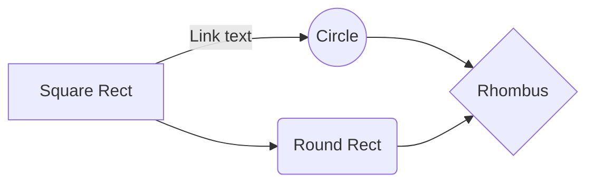
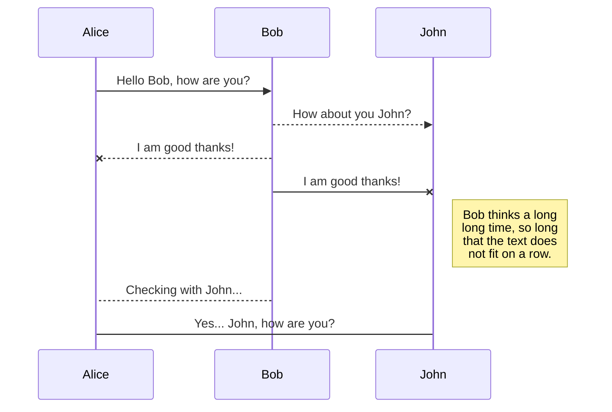

# readme_template

## Índice

- [Overview](#overview)
- [Links](#links)
  - [Badges](#badges)
  - [Shields](#shields)
  - [Mark Down Demo](#md-demo)
- [Templates](#templates)
  - [Linguagem](#linguagem)
  - [Tabela](#tabela)
  - [Flow Chart](#flow-chart)
  - [Diagrama](#diagrama)
  - [Projetos](#projetos)
    - [Nome do Projeto](#nome-do-projeto)
    - [Descrição do Projeto](#descrição)
      - [Features](#features)
    - [Estrutura de Pastas](#estrutura-de-pastas)
    - [Aprendizado](#aprendizado)
    - [Desafios](#desafios)
    - [Construção](#construção)
    - [Tecnologias](#tecnologias)    
- [Autor](#autor)

### Overview

Esse repositório foi feito para manter meu template de Readme para projetos e também para guardar alguns links que eu achei interessante de se ter

## Links

### Badges

Encontra-se nesse repositório do github [Badges](https://github.com/Ileriayo/markdown-badges)


### Shields

<p><a href='https://shields.io/'>shields.io</a></p>


`https://img.shields.io/static/v1?label=<LABEL>&message=<MESSAGE>&color=<COLOR>&style=<STYLE>&logo=<LOGO>`

1. LABEL: texto do campo esquerdo
1. MESSAGE: texto do campo direto
1. COLOR: cor do campo direito, pode usar RGB.
1. STYLE: estilo do badge inteiro. Podemos ter: plastic, flat, for-the-badge, social ou flat-square. Teste cada uma delas.
1. LOGO: logo do campo esquerdo


### MD Demo
[Mark Down Demo](https://markdown-it.github.io/)

## Templates

### Linguagem

* bash

```bash
npm install 
```

* javascript

```javascript
let code = 'clean';
```

### Notas

> **Note:** This is a **Note**. There is no content here, sorry ~


### Tabela


coluna1           |  coluna 2
:-------------------------:|:-------------------------:
item 1  |  item 2

coluna 1         |  coluna 2 | coluna 3
:-------------------------:|:-------------------------:|:-------------------------:
item 1  |  item 2 | item 3
item 4 | item 5 |item 6

### Flow Chart



### Diagrama




### Projetos

# Nome do Projeto

## 📝Descrição

### ⚙Features

- [x] Feature 01
- [x] Cadastro de cliente
- [ ] Cadastro de produtos

## 📂Estrutura de Pastas

VSCode [File tree generator](https://marketplace.visualstudio.com/items?itemName=Shinotatwu-DS.file-tree-generator)

Exemplo do projeto [Clipz](https://github.com/RafaZeero/angular-clipz) (com ícones)
<details>
  
<summary style="font-size:14px">Ver estrutura</summary>
  

  
```markdown
📦src
 ┣ 📂app
 ┃ ┣ 📂about
 ┃ ┃ ┣ 📜about.component.html
 ┃ ┃ ┣ 📜about.component.scss
 ┃ ┃ ┣ 📜about.component.spec.ts
 ┃ ┃ ┗ 📜about.component.ts
 ┃ ┣ 📂clip
 ┃ ┃ ┣ 📜clip.component.html
 ┃ ┃ ┣ 📜clip.component.scss
 ┃ ┃ ┣ 📜clip.component.spec.ts
 ┃ ┃ ┗ 📜clip.component.ts
 ┃ ┣ 📂clips-list
 ┃ ┃ ┣ 📜clips-list.component.html
 ┃ ┃ ┣ 📜clips-list.component.scss
 ┃ ┃ ┣ 📜clips-list.component.spec.ts
 ┃ ┃ ┗ 📜clips-list.component.ts
 ┃ ┣ 📂home
 ┃ ┃ ┣ 📜home.component.html
 ┃ ┃ ┣ 📜home.component.scss
 ┃ ┃ ┣ 📜home.component.spec.ts
 ┃ ┃ ┗ 📜home.component.ts
 ┃ ┣ 📂models
 ┃ ┃ ┣ 📜clip.model.ts
 ┃ ┃ ┗ 📜user.model.ts
 ┃ ┣ 📂nav
 ┃ ┃ ┣ 📜nav.component.html
 ┃ ┃ ┣ 📜nav.component.scss
 ┃ ┃ ┣ 📜nav.component.spec.ts
 ┃ ┃ ┗ 📜nav.component.ts
 ┃ ┣ 📂not-found
 ┃ ┃ ┣ 📜not-found.component.html
 ┃ ┃ ┣ 📜not-found.component.scss
 ┃ ┃ ┣ 📜not-found.component.spec.ts
 ┃ ┃ ┗ 📜not-found.component.ts
 ┃ ┣ 📂pipes
 ┃ ┃ ┣ 📜fb-timestamp.pipe.spec.ts
 ┃ ┃ ┗ 📜fb-timestamp.pipe.ts
 ┃ ┣ 📂services
 ┃ ┃ ┣ 📜auth.service.spec.ts
 ┃ ┃ ┣ 📜auth.service.ts
 ┃ ┃ ┣ 📜clip.service.spec.ts
 ┃ ┃ ┣ 📜clip.service.ts
 ┃ ┃ ┣ 📜ffmpeg.service.spec.ts
 ┃ ┃ ┣ 📜ffmpeg.service.ts
 ┃ ┃ ┣ 📜modal.service.spec.ts
 ┃ ┃ ┗ 📜modal.service.ts
 ┃ ┣ 📂shared
 ┃ ┃ ┣ 📂alert
 ┃ ┃ ┃ ┣ 📜alert.component.html
 ┃ ┃ ┃ ┣ 📜alert.component.scss
 ┃ ┃ ┃ ┣ 📜alert.component.spec.ts
 ┃ ┃ ┃ ┗ 📜alert.component.ts
 ┃ ┃ ┣ 📂directives
 ┃ ┃ ┃ ┣ 📜event-blocker.directive.spec.ts
 ┃ ┃ ┃ ┗ 📜event-blocker.directive.ts
 ┃ ┃ ┣ 📂input
 ┃ ┃ ┃ ┣ 📜input.component.html
 ┃ ┃ ┃ ┣ 📜input.component.scss
 ┃ ┃ ┃ ┣ 📜input.component.spec.ts
 ┃ ┃ ┃ ┗ 📜input.component.ts
 ┃ ┃ ┣ 📂modal
 ┃ ┃ ┃ ┣ 📜modal.component.html
 ┃ ┃ ┃ ┣ 📜modal.component.scss
 ┃ ┃ ┃ ┣ 📜modal.component.spec.ts
 ┃ ┃ ┃ ┗ 📜modal.component.ts
 ┃ ┃ ┣ 📂tab
 ┃ ┃ ┃ ┣ 📜tab.component.html
 ┃ ┃ ┃ ┣ 📜tab.component.scss
 ┃ ┃ ┃ ┣ 📜tab.component.spec.ts
 ┃ ┃ ┃ ┗ 📜tab.component.ts
 ┃ ┃ ┣ 📂tabs-container
 ┃ ┃ ┃ ┣ 📜tabs-container.component.html
 ┃ ┃ ┃ ┣ 📜tabs-container.component.scss
 ┃ ┃ ┃ ┣ 📜tabs-container.component.spec.ts
 ┃ ┃ ┃ ┗ 📜tabs-container.component.ts
 ┃ ┃ ┗ 📜shared.module.ts
 ┃ ┣ 📂user
 ┃ ┃ ┣ 📂auth-modal
 ┃ ┃ ┃ ┣ 📜auth-modal.component.html
 ┃ ┃ ┃ ┣ 📜auth-modal.component.scss
 ┃ ┃ ┃ ┣ 📜auth-modal.component.spec.ts
 ┃ ┃ ┃ ┗ 📜auth-modal.component.ts
 ┃ ┃ ┣ 📂login
 ┃ ┃ ┃ ┣ 📜login.component.html
 ┃ ┃ ┃ ┣ 📜login.component.scss
 ┃ ┃ ┃ ┣ 📜login.component.spec.ts
 ┃ ┃ ┃ ┗ 📜login.component.ts
 ┃ ┃ ┣ 📂register
 ┃ ┃ ┃ ┣ 📜register.component.html
 ┃ ┃ ┃ ┣ 📜register.component.scss
 ┃ ┃ ┃ ┣ 📜register.component.spec.ts
 ┃ ┃ ┃ ┗ 📜register.component.ts
 ┃ ┃ ┣ 📂validators
 ┃ ┃ ┃ ┣ 📜email-taken.spec.ts
 ┃ ┃ ┃ ┣ 📜email-taken.ts
 ┃ ┃ ┃ ┣ 📜register-validators.spec.ts
 ┃ ┃ ┃ ┗ 📜register-validators.ts
 ┃ ┃ ┗ 📜user.module.ts
 ┃ ┣ 📂video
 ┃ ┃ ┣ 📂edit
 ┃ ┃ ┃ ┣ 📜edit.component.html
 ┃ ┃ ┃ ┣ 📜edit.component.scss
 ┃ ┃ ┃ ┣ 📜edit.component.spec.ts
 ┃ ┃ ┃ ┗ 📜edit.component.ts
 ┃ ┃ ┣ 📂manage
 ┃ ┃ ┃ ┣ 📜manage.component.html
 ┃ ┃ ┃ ┣ 📜manage.component.scss
 ┃ ┃ ┃ ┣ 📜manage.component.spec.ts
 ┃ ┃ ┃ ┗ 📜manage.component.ts
 ┃ ┃ ┣ 📂pipes
 ┃ ┃ ┃ ┣ 📜safe-url.pipe.spec.ts
 ┃ ┃ ┃ ┗ 📜safe-url.pipe.ts
 ┃ ┃ ┣ 📂upload
 ┃ ┃ ┃ ┣ 📜upload.component.html
 ┃ ┃ ┃ ┣ 📜upload.component.scss
 ┃ ┃ ┃ ┣ 📜upload.component.spec.ts
 ┃ ┃ ┃ ┗ 📜upload.component.ts
 ┃ ┃ ┣ 📜video-routing.module.ts
 ┃ ┃ ┗ 📜video.module.ts
 ┃ ┣ 📜app-routing.module.ts
 ┃ ┣ 📜app.component.html
 ┃ ┣ 📜app.component.scss
 ┃ ┣ 📜app.component.spec.ts
 ┃ ┣ 📜app.component.ts
 ┃ ┗ 📜app.module.ts
 ┣ 📂assets
 ┃ ┣ 📂img
 ┃ ┃ ┗ 📜author_img.jpg
 ┃ ┣ 📂video
 ┃ ┃ ┗ 📜hero.webm
 ┃ ┗ 📜.gitkeep
 ┣ 📂environments
 ┃ ┣ 📜environment.prod.ts
 ┃ ┗ 📜environment.ts
 ┣ 📜favicon.ico
 ┣ 📜index.html
 ┣ 📜main.ts
 ┣ 📜polyfills.ts
 ┣ 📜styles.scss
 ┗ 📜test.ts
```

  
</details>


## 📚Aprendizado

## 🚀Desafios

## 🚧Construção

## ⚡Tecnologias

## 😄Autor 


<table>
  <tr>
    <td align="center">
      <a href="https://www.linkedin.com/in/rafael99ldm/">
        <br>
        <sub>
          <b>Rafael Lima</b>
        </sub>
      </a>
    </td>
  </tr>
</table>
